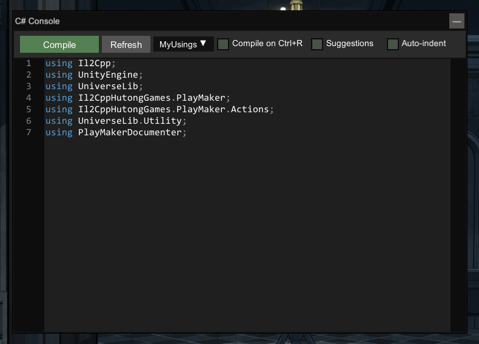
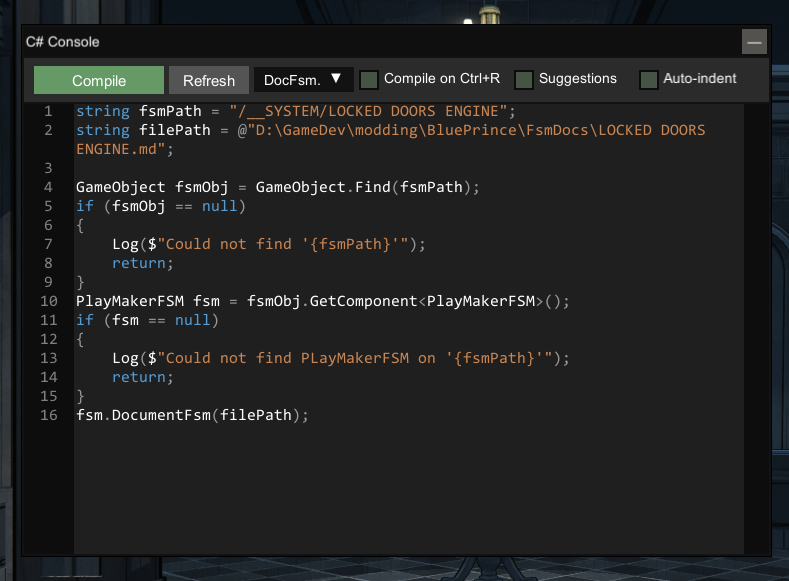

# PlayMaker Documenter

A MelonLoader mod for documenting PlayMaker Finite-State Machines (FSMs) in Unity video games with markdown.

This mod is currently tested only on Blue Prince.

## Table of Contents

- [PlayMaker Documenter](#playmaker-documenter)
  - [Table of Contents](#table-of-contents)
  - [Installation](#installation)
  - [Example Output](#example-output)
  - [Usage](#usage)
    - [MelonLoader Mod Project](#melonloader-mod-project)
    - [UnityExplorer User Script](#unityexplorer-user-script)
  - [Developing Locally](#developing-locally)
  - [Building](#building)
  - [Publishing](#publishing)
  - [Supported Action Details](#supported-action-details)
  - [Developing New Action Details](#developing-new-action-details)
  - [MarkdownUtilities](#markdownutilities)
  - [UniverseLib](#universelib)

## Installation

1. Install [Melon Loader](https://melonwiki.xyz/#/?id=automated-installation) for Blue Prince
2. Download an install [UnityExplorer](https://github.com/yukieiji/UnityExplorer)
3. Download the [latest release](https://github.com/markekraus/PlayMakerDocumenter/releases)
4. Copy `PlayMakerDocumenter.ML.IL2CPP.dll` to the `Mods` folder in your Blue Prince install folder (i.e. `C:\Program Files (x86)\Steam\steamapps\common\Blue Prince\Mods`)

## Example Output

You can see example FSM docs [here](Examples/FsmDocs).

## Usage

This mod is primarily used by other mods or in conjunction with [UnityExplorer](https://github.com/yukieiji/UnityExplorer) (yukieji's fork) for reverse engineering [PlayMaker](https://hutonggames.com/) FSMs.
Currently, this mod cannot be used on its own.
Maybe one day I'll make a UI for it.

### MelonLoader Mod Project

You can reference the DLL in your csproj file:

```xml
    <ItemGroup>
        <Reference Include="PlayMakerDocumenter">
            <HintPath>..\path\to\PlayMakerDocumenter.ML.IL2CPP.dll</HintPath>
            <Private>false</Private>
        </Reference>
    </ItemGroup>
```

You can then use `FsmDocumenter` in your project:

```csharp
using PlayMakerDocumenter;

namespace MyMod;

public class MyMod : MelonMod
{
    public override void OnSceneWasLoaded(int buildIndex, string sceneName)
    {
        if (sceneName != "Mount Holly Estate") return;

        string fsmPath = "/__SYSTEM/LOCKED DOORS ENGINE";
        string filePath = @"D:\GameDev\modding\BluePrince\FsmDocs\LOCKED DOORS ENGINE.md";

        GameObject fsmObj = GameObject.Find(fsmPath);
        if (fsmObj is null)
        {
            LoggerInstance.Msg($"Could not find '{fsmPath}'");
            return;
        }
        PlayMakerFSM fsm = fsmObj.GetComponent<PlayMakerFSM>();
        if (fsm is null)
        {
            LoggerInstance.Msg($"Could not find PLayMakerFSM on '{fsmPath}'");
            return;
        }
        fsm.DocumentFsm(filePath);
    }
}
```

### UnityExplorer User Script

UnityExplorer's C# console was the original use case for this mod.
[2 user scripts](Examples/UnityExplorerUserScripts/) have been included in the examples.
Download those an place them in your game's `Mods\sinai-dev-UnityExplorer\Scripts`.
With Blue Prince from Steam, the full path looks like `C:\Program Files (x86)\Steam\steamapps\common\Blue Prince\Mods\sinai-dev-UnityExplorer\Scripts`

Then you can use them in the UnityExplorer C# console.

1. Select the MyUsings.cs from the drop down.
2. Click Compile at least twice.
3. Select the DocFsm.cs from the drop down.
4. Modify the FSM path and file path
5. Click Compile twice

Yes, you must click compile at least twice for each step.

 

The result will be an entry in the log like this

```text
17:31:16.169] [UnityExplorer] Try Update exists code....
[17:31:16.172] [UnityExplorer] Success!! override
replacing fieldspec for fsmPath
replacing fieldspec for filePath
replacing fieldspec for fsmObj
replacing fieldspec for fsm
[17:31:17.290] [PlayMakerDocumenter] FSM Doc: D:\GameDev\modding\BluePrince\FsmDocs\LOCKED DOORS ENGINE.md
[17:31:17.292] [UnityExplorer] Invoked REPL (no return value)
[17:31:17.293] [UnityExplorer] Try Update exists code....
[17:31:17.295] [UnityExplorer] Success!! override
```

## Developing Locally

1. Download an install [UnityExplorer](https://github.com/yukieiji/UnityExplorer)
2. Navigate to the game folder (i.e. `C:\Program Files (x86)\Steam\steamapps\common\Blue Prince\`)
3. Create `ModeCode`
4. Open a shell navigate to the `ModCode` folder
5. Run the following:

```powershell
git clone --recurse-submodules https://github.com/markekraus/PlayMakerDocumenter.git
cd PlayMakerDocumenter
get checkout -b mychanges
code .
```

This readme file would be at `C:\Program Files (x86)\Steam\steamapps\common\Blue Prince\ModCode\PlayMakerDocumenter\README.md`

This mod was developed in VS Code, not full Visual Studio.
I Cannot vouch for how it may or may not work in full Visual Studio.

The paths to the relevant MelonLoader and game assemblies should work from a relative path to the game folder of `<GamFolder>\ModCode\PlayMakerDocumenter\`.
This provides the benefit of working with the game devs' custom FSM Actions not shipped by the PlayMaker devs.

## Building

```powershell
& .\build.ps1
```

## Publishing

When [Developing Locally](#developing-locally), you can build and publish this mod to your game's mod folder as follows:

```powershell
& .\publish.ps1
```

## Supported Action Details

PlayMaker ships with 100's of State Actions.
Each State Action type has its own unique properties requiring a manual documenter for each (for now).
As such, there is currently limited support for a decent number of commonly used Action Types.
The available types are listed in [src/Actions](src/Actions).

## Developing New Action Details

For this demo, I will use the fictional State Action `SeizeMeansOfProduction`

Create `src\Actions\Documenter.SeizeMeansOfProduction.cs` with this scaffolding:

```csharp
using System.Text;
using Il2CppHutongGames.PlayMaker.Actions;

namespace PlayMakerDocumenter.Actions;

public static partial class Documenter
{
    private static StringBuilder DocActionSeizeMeansOfProduction(this StringBuilder sb, SeizeMeansOfProduction action, ActionContext ctx) =>
        action is null
        ? sb
        : sb.AppendHeader($"{nameof(SeizeMeansOfProduction)} Details:")
            .NewTable()
            .WithPropertyValueHeaders()
            .BuildTable();
}
```

Then update [`src/Actions/Documenter.cs`](src/Actions/Documenter.cs) to insert the documenter in alpha order:

```csharp
    private static StringBuilder DocStateActionTypeDetails(this StringBuilder sb, ActionContext ctx) =>
        ctx is null || ctx.Action is null || ctx.EventToState is null
        ? sb
        : ctx.ActionType.FullName switch
        {
            "Il2CppHutongGames.PlayMaker.Actions.ActivateGameObject" => sb.DocActionActivateGameObject(ctx.Action.TryCast<ActivateGameObject>(), ctx),
            "Il2CppHutongGames.PlayMaker.Actions.ArrayListGet" => sb.DocActionArrayListGet(ctx.Action.TryCast<ArrayListGet>(), ctx),
            "Il2CppHutongGames.PlayMaker.Actions.ArrayListSet" => sb.DocActionArrayListSet(ctx.Action.TryCast<ArrayListSet>(), ctx),
            // ...
            "Il2CppHutongGames.PlayMaker.Actions.SeizeMeansOfProduction" => sb.DocActionSeizeMeansOfProduction(action.TryCast<SeizeMeansOfProduction>(), ctx),
            // ...
```

Then draw the rest of the owl.

## MarkdownUtilities

Because this a pet project, of course it spawned more pet projects.
This project makes heavy use of [MarkdownUtilities](https://github.com/markekraus/MarkdownUtilities) ( MIT license ) to generate markdown tables.
MarkdownUtilities is IL repacked into the shipped DLL for this mod and is not a required dependency for shipping mods that use this mod.

## UniverseLib

Il2Cpp games are a pain.
In Il2Cpp, generic collection types always return collection members as the collection's generic type and _not_ as its actual runtime type.
This is a solved problem in UnityExplorer, which is using UniverseLib under the hood.
Since I am using yukikeiji's port of UnityExplorer, I'm also using their port of [UniverseLib](https://github.com/yukieiji/UniverseLib) ( LGPL-2.1 license ).
I've not made any modification to their code.
I'm also not currently shipping the library with this mod.
